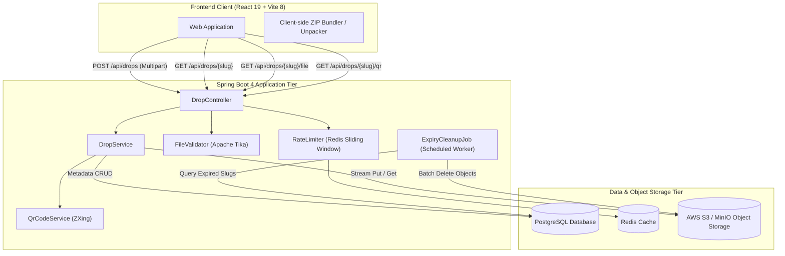

# dropctl

Temporary File Sharing with Self-Deleting Links and Automated Storage Purging.

Live Deployment: [https://dropctl.shshwt.me](https://dropctl.shshwt.me)

[](https://openjdk.org/)
[](https://spring.io/projects/spring-boot)
[](https://react.dev/)
[](https://www.typescriptlang.org/)
[](https://tailwindcss.com/)
[](https://www.postgresql.org/)
[](https://redis.io/)
[](https://aws.amazon.com/s3/)
[](https://vitejs.dev/)

---

## Overview

**dropctl** is an ephemeral file-sharing service deployed at [dropctl.shshwt.me](https://dropctl.shshwt.me). Designed for fast, registration-free file distribution, it generates short shareable links and QR codes with user-defined lifespans. Once a link expires, all associated files and database records are permanently deleted.

### Key Capabilities
- **Zero Registration**: Direct uploads without accounts, sessions, or tracking cookies.
- **Client-Side ZIP Bundling**: Multiple selected files are packaged into a single ZIP in the browser prior to transfer, while single files upload as-is.
- **Content Inspection**: Server-side validation via Apache Tika verifies file magic bytes to prevent MIME-type spoofing.
- **Automated Lifecycle Management**: A background scheduler continuously purges expired metadata and underlying S3/MinIO objects.
- **Low-Latency Architecture**: Sub-150ms metadata lookups and direct S3 stream passthrough with Redis sliding-window rate limiting.

---

## Performance Benchmarks

Performance metrics measured under load across core HTTP endpoints:

### 1. Read and Retrieval Latency (`GET`)

| Endpoint / Operation | Mean Latency | Min Latency | Max Latency | Relative Performance |
| :--- | ---: | ---: | ---: | :--- |
| **Drop Info** (`GET /api/drops/{slug}`) | **135.6 ± 4.9 ms** | 128.5 ms | 147.8 ms | **1.00** (Baseline) |
| **QR Code Generation** (`GET /api/drops/{slug}/qr`) | **148.6 ± 6.0 ms** | 138.5 ms | 163.4 ms | 1.10 ± 0.06 |
| **File Download** (`GET /api/drops/{slug}/file`) | **164.0 ± 5.2 ms** | 153.3 ms | 177.4 ms | 1.21 ± 0.06 |
| **Health Check** (`GET /actuator/health`) | **169.5 ± 97.2 ms** | 128.9 ms | 527.6 ms | 1.25 ± 0.72 |

### 2. File Upload Throughput (`POST`)

| Operation | Mean Latency | Min Latency | Max Latency |
| :--- | ---: | ---: | ---: |
| **Multipart File Upload** (`POST /api/drops`) | **240.3 ± 112.4 ms** | 185.5 ms | 517.4 ms |

### Performance Observations
- **Low Metadata Variance**: Drop metadata lookups average `135.6 ms` with a standard deviation of `±4.9 ms`.
- **Direct S3 Streaming**: File downloads stream directly through the application tier within `164 ms` without buffering file payloads in application memory.
- **Dynamic QR Encoding**: On-the-fly ZXing QR generation executes in under `150 ms`.

---

## System Architecture



---

## Supported File Formats

dropctl supports payloads up to **100 MB** per drop across 6 categories:

| Category | Extensions | MIME Signatures |
| :--- | :--- | :--- |
| **Images & Vectors** | `.jpg`, `.jpeg`, `.png`, `.gif`, `.webp`, `.svg` | `image/jpeg`, `image/png`, `image/webp`, `image/svg+xml`, etc. |
| **Documents & Data** | `.pdf`, `.txt`, `.md`, `.csv`, `.json`, `.yaml`, `.yml`, `.xml`, `.sql`, `.docx`, `.xlsx`, `.pptx` | `application/pdf`, `text/markdown`, `application/json`, `text/csv`, etc. |
| **Code & Scripts** | `.js`, `.jsx`, `.ts`, `.tsx`, `.py`, `.java`, `.c`, `.cpp`, `.h`, `.hpp`, `.cs`, `.go`, `.rs`, `.php`, `.rb`, `.html`, `.htm`, `.css`, `.sh`, `.bash` | `application/javascript`, `text/x-python`, `text/x-java-source`, `text/plain`, etc. |
| **Archives** | `.zip`, `.tar`, `.gz` | `application/zip`, `application/x-tar`, `application/gzip` |
| **Audio** | `.mp3`, `.wav`, `.ogg`, `.m4a`, `.flac`, `.aac` | `audio/mpeg`, `audio/wav`, `audio/ogg`, `audio/mp4`, `audio/flac` |
| **Video** | `.mp4`, `.mov`, `.webm`, `.mkv`, `.avi` | `video/mp4`, `video/quicktime`, `video/webm`, `video/x-matroska` |

---

## REST API Specification

### 1. Upload File or Bundle
```http
POST /api/drops
Content-Type: multipart/form-data
```
**Request Parameters:**
- `file` (*required*, Binary): File payload (maximum 100 MB).
- `slug` (*optional*, String): Custom alphanumeric slug (3 to 32 characters, regex: `^[a-z0-9][a-z0-9-]{1,30}[a-z0-9]$`).
- `expiresInHours` (*optional*, Integer): Expiry window between 1 and 168 hours (default: 24).
- `isBundle` (*optional*, Boolean): Set to `true` when uploading a client-packaged multi-file archive.

**Response (`201 Created`):**
```json
{
  "slug": "project-specs",
  "fileName": "project-specs.pdf",
  "contentType": "application/pdf",
  "sizeBytes": 2048576,
  "createdAt": "2026-09-24T12:00:00Z",
  "expiresAt": "2026-09-25T12:00:00Z",
  "isBundle": false,
  "url": "https://dropctl.shshwt.me/#project-specs",
  "qrCodeDataUri": "data:image/png;base64,..."
}
```

---

### 2. Retrieve Drop Metadata
```http
GET /api/drops/{slug}
```
**Response (`200 OK`):**
```json
{
  "slug": "project-specs",
  "fileName": "project-specs.pdf",
  "contentType": "application/pdf",
  "sizeBytes": 2048576,
  "createdAt": "2026-09-24T12:00:00Z",
  "expiresAt": "2026-09-25T12:00:00Z",
  "isBundle": false
}
```
*Returns `404 Not Found` if the slug does not exist or `410 Gone` if expired.*

---

### 3. Stream File Content
```http
GET /api/drops/{slug}/file
```
**Response (`200 OK`):**
- Streams raw binary data.
- Headers:
  - `Content-Disposition: attachment; filename="<original_name>"`
  - `X-Content-Type-Options: nosniff`
  - `Cache-Control: no-store`

---

### 4. Fetch QR Code
```http
GET /api/drops/{slug}/qr
```
**Response (`200 OK`):**
- Returns raw PNG image bytes (`image/png`).

---

## Configuration Reference

### Environment Variables

| Variable | Description | Default / Example |
| :--- | :--- | :--- |
| `DB_URL` | PostgreSQL JDBC connection URL | `jdbc:postgresql://localhost:5432/dropctl` |
| `DB_USERNAME` | PostgreSQL username | `postgres` |
| `DB_PASSWORD` | PostgreSQL password | `postgres` |
| `REDIS_HOST` | Redis instance host | `localhost` |
| `REDIS_PORT` | Redis instance port | `6379` |
| `S3_BUCKET_NAME` | AWS S3 or MinIO bucket name | `dropctl-storage` |
| `AWS_REGION` | AWS S3 region | `us-east-1` |
| `AWS_ACCESS_KEY_ID` | Storage access key ID | `AKIA...` (Optional for IAM roles) |
| `AWS_SECRET_ACCESS_KEY` | Storage secret access key | `secret` |
| `APP_BASE_URL` | Public origin URL used for shareable link generation | `https://dropctl.shshwt.me` |
| `DROPCTL_PROXY_TRUST_FORWARDED_HEADERS` | Trust `X-Forwarded-For` and `CF-Connecting-IP` headers | `true` or `false` |
| `VITE_SITE_URL` | Frontend origin for canonical and Open Graph metadata | `https://dropctl.shshwt.me` |

---

## Local Development & Setup

### Prerequisites
- Java 21 (JDK)
- Node.js 20+ and npm
- PostgreSQL 15+
- Redis 7+
- AWS S3 bucket or MinIO instance

---

### 1. Clone Repository
```bash
git clone https://github.com/BeingShashwat/dropctl.git
cd dropctl
```

### 2. Backend Setup
Configure environment variables in a `.env` file or export them directly:
```properties
DB_URL=jdbc:postgresql://localhost:5432/dropctl
DB_USERNAME=postgres
DB_PASSWORD=postgres
REDIS_HOST=localhost
REDIS_PORT=6379
S3_BUCKET_NAME=dropctl-storage
AWS_REGION=us-east-1
APP_BASE_URL=http://localhost:5173
```

Run Flyway migrations and launch the Spring Boot service:
```bash
./mvnw spring-boot:run
```
The server listens on `http://localhost:8080`.

---

### 3. Frontend Setup
```bash
cd frontend
npm install
npm run dev
```
The client runs on `http://localhost:5173` with local API proxy forwarding to port `8080`.

---

### 4. Production Build
```bash
# Build Backend JAR
./mvnw clean package -DskipTests

# Build Frontend Static Assets
cd frontend
npm run build
```

---

## Security & Privacy Model

- **No User Identity Tracking**: No accounts, tracking pixels, or identifying persistence.
- **Header Controls**: Strict `X-Content-Type-Options: nosniff` and `Cache-Control: no-store` prevents browser/proxy content sniffing and caching.
- **Abuse Prevention**: Sliding-window rate limiting keyed by client IP prevents automated resource exhaustion.
- **Storage Isolation**: Content keys are isolated with randomized UUID paths in S3 storage.
- **Deterministic Cleanup**: Scheduled background worker runs every 5 minutes (`cleanup-interval: PT5M`) to delete expired records and files.
